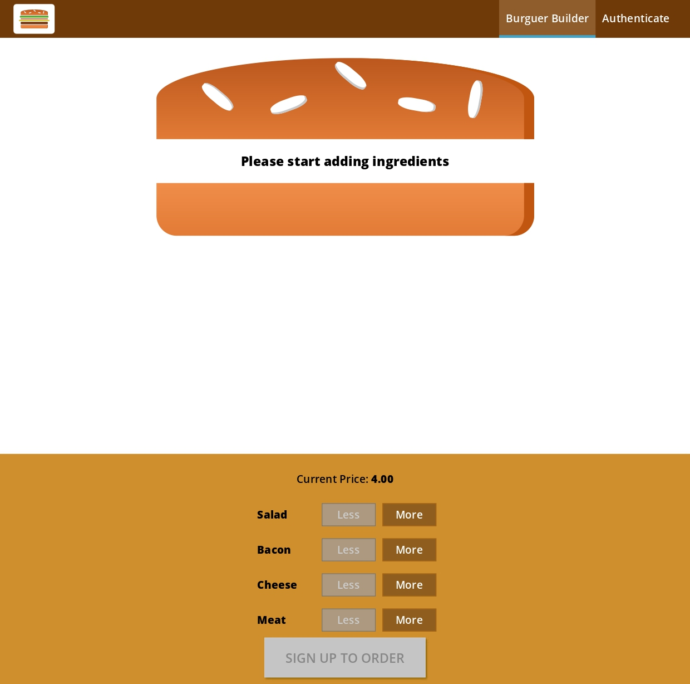

- [What is React](#orgddfcfd6)
- [JavaScript Frameworks](#orgbe8759f)
- [Why React?](#orgdc6ed2f)
- [What is React?](#org6e835d5)
- [Features Of React](#org4fe89c1)
- [Project Modules & Services](#org8576c22)
  - [Modules used:](#org847724e)
  - [Services used:](#org9904dc8)
- [Course Project](#org9a8959e)
  - [[React Course Project](https://react-course-project-31af6.web.app/)](#org46e382d)
- [Useful Resources & Links](#org2a240a4)

---

# What is React

React is the most popular front-end JavaScript library in the field of web development. It is used by large, established companies and newly-minted startups alike (Netflix, Airbnb, Instagram, and the New York Times, to name a few). React brings many advantages to the table, making it a better choice than other frameworks like Angular.js.

# JavaScript Frameworks

Javascript is a dynamic programming language which is widely used for developing web applications. It is very lightweight and is supported by most of the modern browsers. Moreover, JavaScript supports both object-oriented programming and procedural programming. Thus, it is used for creating web pages with a client-side script to interact with the user and make the web pages dynamic and robust. JavaScript has many frameworks among which we can choose depending on our need. Below diagram shows some popular JavaScript frameworks.

Major advantages provided by the JavaScript Frameworks:

1.  **Efficiency**: With the use of pre-built patterns and functions, the development of the applications became easy. The projects which used to take months to develop can now be developed in very less time. This increased the efficiency as well as reduced the time and effort involved.
2.  **Security**: As JavaScript is an open source community, its top frameworks have strong security arrangements. Frameworks are supported by these large communities in which, the members and the users can also act as testers. This increases the chances of detecting any kind of backdoor or bug present in the framework. Thus providing better security at less cost.
3.  **Cost Reduction**: JavaScript Frameworks are free for public use as they are open source. So, when we develop a web application using these frameworks, the overall cost of the application is much lesser.

Because of all these advantages, JavaScript frameworks are used heavily for developing web-applications. They have already proved their potential over the past few years. Among them, the most popular ones are React and Angular.

# Why React?

# What is React?

React is a component-based library which is used to develop interactive UI’s (User Interfaces). It is currently one of the most popular JavaScript front-end libraries which has a strong foundation and a large community supporting it.

In ReactJS, everything is a component. Consider one lego house as an entire application. Then compare each of the lego blocks to a component which acts as a building block. These blocks/ components are integrated together to build one bigger and dynamic application.

The biggest advantage of using components is that you can change any component at any point in time without affecting the rest of the applications. This feature is most effective when implemented with larger and real-time applications where data changes frequently. Each time any data is added or updated, ReactJS automatically updates the specific component whose state has actually changed. This saves the browser from the task of reloading the whole application to reflect the changes.

# Features Of React

1.  **JSX**: JSX stands for JavaScript XML. Its an XML/ HTML like syntax used by React. It extends the ECMAScript so that XML/ HTML like text can co-exist along with JavaScript react code. This syntax is used by the pre-processors like Babel to transform HTML like text found in JavaScript files into standard JavaScript objects. With JSX, we can go a step further by again embedding the HTML code inside the JavaScript. This makes HTML codes easy to understand and boosts JavaScript’s performance while making our application robust.
    
    

2.  **Virtual DOM**: Like an actual DOM, virtual DOM is also a node tree that lists the elements and their attributes and content as Objects and their properties. React’s render function creates a node tree out of the React components. Then, it updates this tree in response to the mutations in data model caused by various actions done either by the user or by the system.
    
    This virtual DOM works in three simple steps:
    
    1.  Whenever any underlying data changes, the entire UI is re-rendered in Virtual DOM representation.
        
        
    
    2.  Then the difference between the previous DOM representation and the new one is calculated.
        
        

1.  Once the calculations are done, the real DOM will be updated with only the things that have actually changed. You can think of it as a patch. As patches are applied only to the affected area, similarly, the virtual DOM acts as patches and are applied to the elements which are updated or changed, in the real DOM.
    
    

1.  **Testability**: React views can be used as functions of the state (state is an object which determines how a component will render and behave). Thus, we can easily manipulate with state of the components which we pass to the ReactJS view and take a look at the output and triggered actions, events, functions, etc. This makes React applications quite easy to test and debug.

2.  **Server-Side Rendering(SSR)**: Server-Side rendering allows you to pre-render the initial state of your react components at the server side only. With SSR, the server’s response to the browser becomes only the HTML of the page which is now ready to be rendered. Thus, the browser can now start rendering without having to wait for all the JavaScript to be loaded and executed. As a result, the webpage loads faster. Here the user will be able to see the web page in spite of React still downloading the JavaScript, creating the virtual DOM, linking events, etc. at the back end.
    1.  **One-Way Data Binding**: Unlike other frameworks, ReactJS follows unidirectional data flow or one-way data binding. The major advantage of One-Way-Data binding is that throughout the application the data flows in a single direction which gives you better control over it. Because of this, application’s state is contained in specific stores and as a result, rest of the components remains loosely coupled. This makes our application more flexible leading to increased efficiency.
        
        
    
    2.  **Simplicity**: Use of JSX files makes the application really simple and easy to code as well as understand. Even though we can use plain JavaScript here, using JSX is easier. React’s component-based approach along with distinct lifecycle methods also make it simple to learn.
    
    3.  **Learning Curve**: Learning curve of React is quite low as compared to other frameworks. Anyone having even basic knowledge of programming can easily learn React. So, if you have previous knowledge of HTML and JavaScript you can get your hands on it very quickly.

# Project Modules & Services

## Modules used:

-   create-react-app
-   radium
-   styled-components
-   prop-types
-   axios
-   react-router
-   react-router-dom
-   redux
-   react-redux
-   redux-thunk
-   jest
-   enzyme
-   react-transition-group
-   redux-saga

## Services used:

-   [Json Placeholder](https://jsonplaceholder.typicode.com/)

# Course Project

## [React Course Project](https://react-course-project-31af6.web.app/)

# Useful Resources & Links

-   [create-react-app](https://github.com/facebookincubator/create-react-app)

-   [Introducing JSX](https://reactjs.org/docs/introducing-jsx.html)

-   [Rendering Elements](https://reactjs.org/docs/rendering-elements.html)

-   [Components & Props](https://reactjs.org/docs/components-and-props.html)

-   [stateful-vs-stateless-vs-pure-react-components](https://blog.jscrambler.com/stateful-vs-stateless-vs-pure-react-components/)

-   [Components: stateful, stateless, dumb and smart](https://medium.com/@michelestieven/components-stateful-stateless-dumb-and-smart-2847dd4092f2)

-   [Functional Components vs. Class Components in React](https://betterprogramming.pub/functional-components-vs-class-components-in-react-2f28adccc993)

-   [Listenable Events](https://reactjs.org/docs/events.html)

-   [State and Props](https://reactjs.org/docs/faq-state.html#gatsby-focus-wrapper)

-   [ReactJs: Props vs. State](https://lucybain.com/blog/2016/react-state-vs-pros/)

-   [Conditional Rendering](https://reactjs.org/docs/conditional-rendering.html)

-   [Lists & Keys](https://reactjs.org/docs/lists-and-keys.html)

-   [Using CSS Modules in create-react-app Projects](https://medium.com/nulogy/how-to-use-css-modules-with-create-react-app-9e44bec2b5c2)

-   [More information about CSS Modules](https://github.com/css-modules/css-modules)

-   [Error Boundaries](https://reactjs.org/docs/error-boundaries.html)

-   [Chrome Devtool Debugging](https://developers.google.com/web/tools/chrome-devtools/javascript/)

-   [More on useEffect() ](https://reactjs.org/docs/hooks-effect.html)

-   [State & Lifecycle ](https://reactjs.org/docs/state-and-lifecycle.html)

-   [PropTypes ](https://reactjs.org/docs/typechecking-with-proptypes.html)

-   [Higher Order Components](https://reactjs.org/docs/higher-order-components.html)

-   [Refs](https://reactjs.org/docs/refs-and-the-dom.html)

-   [Validate.js](https://validatejs.org/)

-   [Get more ideas about potential validation approaches](https://react.rocks/tag/Validation)

-   [react-validation package](https://www.npmjs.com/package/react-validation)

-   [formsy-react package](https://github.com/christianalfoni/formsy-react)

-   [Immutable Update Patterns on reduxjs.org](https://redux.js.org/recipes/structuring-reducers/immutable-update-patterns/)

-   [Redux Docs](https://redux.js.org/)

-   [Core Concepts](https://redux.js.org/introduction/core-concepts)

-   [Actions](https://redux.js.org/basics/actions)

-   [Reducers](https://redux.js.org/basics/reducers)

-   [Redux FAQs](https://redux.js.org/faq)

-   [Middleware](https://redux.js.org/advanced/middleware/)

-   [redux-thunk package](https://github.com/gaearon/redux-thunk)

-   [Async Actions](https://redux.js.org/advanced/async-actions)

-   [SPA Authentication in general](https://stormpath.com/blog/token-auth-spa)

-   [Firebase authentication REST API](https://firebase.google.com/docs/reference/rest/auth/)

-   [Enzyme API](http://airbnb.io/enzyme/docs/api/)

-   [Jest Docs](https://facebook.github.io/jest/)

-   [Webpack Docs](https://webpack.js.org/concepts/)

-   [More about Babel](https://babeljs.io/)

-   [Next.js Repo & Docs](https://github.com/zeit/next.js/)

-   [More on CSS Transitions](https://developer.mozilla.org/en-US/docs/Web/CSS/CSS_Transitions/Using_CSS_transitions)

-   [More on CSS Animations](https://developer.mozilla.org/en-US/docs/Web/CSS/CSS_Animations/Using_CSS_animations)

-   [More on ReactTransitionGroup](https://github.com/reactjs/react-transition-group)

-   [Alternative => React Motion](https://github.com/chenglou/react-motion)

-   [Alternative => React Move](https://github.com/react-tools/react-move)

-   [Animating Route Animations](https://github.com/maisano/react-router-transition)

-   [Redux Saga: Full Documentation](https://redux-saga.js.org/)

-   [Advanced Concepts](https://redux-saga.js.org/docs/advanced/)

-   [API Reference](https://redux-saga.js.org/docs/api/)

-   [Pros & Cons for Redux Saga vs Thunks](https://stackoverflow.com/questions/34930735/pros-cons-of-using-redux-saga-with-es6-generators-vs-redux-thunk-with-es2017-asy/34933395)

-   [Official Hooks Docs](https://reactjs.org/docs/hooks-intro.html)

-   [More on React Hook](https://reactjs.org/docs/hooks-intro.html)

-   [npm Custom Store Hook package](https://www.npmjs.com/package/use-global-hook)
